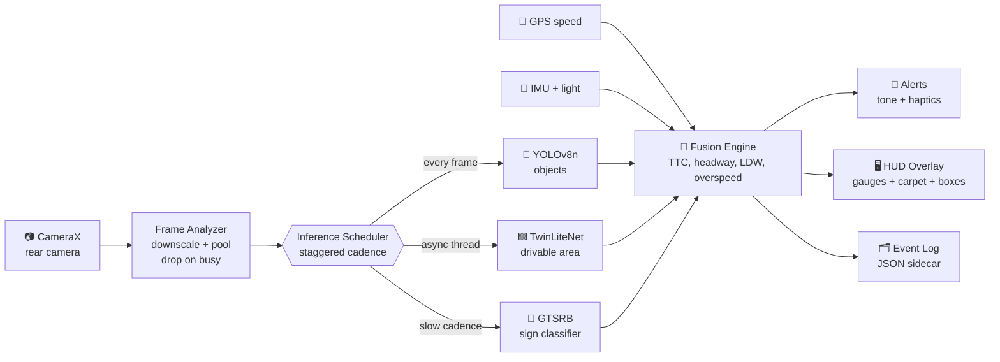

<div align="center">

# 🛣️ Lyne ADAS

### Turn any Android phone into a real-time driver assistance system.

100% on-device. No cloud. No subscriptions. One APK that auto-tunes from a 2GB budget phone to a flagship with an NPU.


<br/>


[**📥 Download APK**](https://github.com/Sherin-SEF-AI/Lyne-ADAS/releases/latest) | [**🏗️ Architecture**](ARCHITECTURE.md) | [**🧠 Models**](models/README.md) | [**⚠️ Safety**](#-safety-and-limitations)

</div>

---

## 🚗 What is Lyne ADAS?

Lyne is a **warning-only Advanced Driver Assistance System (ADAS Level 1)** that runs entirely on your phone's rear camera and sensors. Mount it on the windshield, start a drive, and it watches the road for you: vehicles closing in, pedestrians stepping out, lane drift, tailgating, and speed-limit signs.

Every model runs **on the device**. Nothing leaves the phone. It works offline, costs nothing to run, and adapts its own workload to whatever hardware it lands on.

> 🟢 **Real models, not demos.** Real YOLOv8n object detection, real drivable-area segmentation, and a real GTSRB traffic-sign classifier are bundled and verified running on a physical device.

## ✨ Features

| | Feature | What it does |
|---|---|---|
| 🚙 | **Forward Collision Warning** | Monocular distance plus scale-based time-to-collision, with escalating audio, visual, and haptic alerts |
| 🟩 | **Drivable-Area Segmentation** | A real-time neural segmentation net paints the road ahead as a green "carpet" and drives lane-keeping |
| 🚶 | **Vulnerable Road Users** | Detects pedestrians, two-wheelers, cyclists, and auto-rickshaws in the ego path |
| 📏 | **Headway Monitor** | Continuous following-distance readout in seconds, with a tailgating warning |
| 🛑 | **Traffic Sign Recognition** | Speed-limit and stop-sign recognition, compared against GPS speed for overspeed alerts |
| 🎚️ | **Self-Tuning Tiers** | A boot-time probe benchmarks the device and picks input size, model variant, cadence, and backend |
| 🌗 | **Auto Day / Night HUD** | Ambient-light sensor switches between a daylight and a low-glare night theme |
| 📊 | **Drive Sessions** | Live trip stats plus an event log exportable as a portable JSON sidecar |

## 🧠 How it works



The camera analyzer never blocks: it copies each frame into a reused buffer, closes the image, and submits to a single inference thread with a bounded queue. The heavy segmentation model runs on its **own worker thread** so it never stalls collision detection. There are **zero per-frame allocations** in the hot path. Full design notes live in [ARCHITECTURE.md](ARCHITECTURE.md).

## 📱 One APK, every phone

A capability probe (RAM, cores, GPU, NNAPI, plus a CPU micro-benchmark) classifies the device in under 3 seconds and loads a declarative profile:

| | 🅰️ Tier A (flagship) | 🅱️ Tier B (mid-range) | 🅲 Tier C (entry / Go) |
|---|---|---|---|
| Input resolution | 384 px | 256 px | 256 px |
| FPS target | 30+ | 15+ | 8+ |
| Object model | YOLOv8n | YOLOv8n nano | YOLOv8n nano |
| Drivable area | Neural seg | Neural seg | Classical seg |
| Backend | NNAPI / GPU | NNAPI / GPU | XNNPACK CPU |
| Pixel format | ARGB_8888 | ARGB_8888 | RGB_565 |
| Sign recognition | On | On | Off |

Thermal status and memory pressure throttle cadence and resolution at runtime, then recover when the device cools down.

## 🧩 Bundled models

| Model | Job | Format |
|---|---|---|
| **YOLOv8n (COCO)** | Vehicles, people, two-wheelers, stop signs | INT8 TFLite |
| **TwinLiteNet** | Drivable-area segmentation (the green carpet) | TFLite |
| **GTSRB classifier** | Speed-limit and stop-sign reading | INT8 TFLite |
| **Classical CV** | Model-free drivable-area fallback for entry devices | Pure Kotlin |

Conversion scripts and a fine-tuning recipe for India-specific roads (IDD) are in [models/](models/README.md).

## 🚀 Quick start

**Just want to try it?** Grab the APK from [Releases](https://github.com/Sherin-SEF-AI/Lyne-ADAS/releases/latest) and sideload it.

**Build from source:**

```bash
git clone https://github.com/Sherin-SEF-AI/Lyne-ADAS.git
cd Lyne-ADAS

# point local.properties at your Android SDK, then:
./gradlew :app:assembleDebug
adb install -r app/build/outputs/apk/debug/app-debug.apk
```

Requirements: JDK 17, Android SDK platform 35, build-tools 35. A Gradle wrapper is included.

- **minSdk** 26, **target / compile** 35
- Kotlin 2.1, Jetpack Compose, CameraX 1.4, LiteRT 1.0, Play Services Location 21.3

## 🎯 Calibration

Monocular distance depends on field of view. Lyne reads camera intrinsics from the device when available, and the in-app calibration wizard lets you fine-tune the effective FoV and a distance scale against a known gap. Values persist per device.

## 🗺️ Roadmap

- [ ] India Driving Dataset (IDD) fine-tuned segmentation weights
- [ ] Dashcam event clip recording (ring buffer)
- [ ] Cyclist and animal classes for rural roads
- [ ] Bluetooth auto-start on drive detection
- [ ] CI build and instrumented tests

## ⚠️ Safety and limitations

> 🚨 **Lyne is a warning-only aid. It never controls the vehicle. Keep your eyes on the road and your hands on the wheel.**

- Monocular distance and TTC are estimates from bounding-box geometry on a flat-road assumption. Low-confidence estimates are suppressed, never escalated to a hard alert.
- Drivable-area and sign recognition accuracy depend on lighting, weather, and marking quality.
- HUD overlay alignment is approximate (it assumes a center-crop preview).
- This is research and educational software, provided as is, with no warranty.

## 👤 Author

**sherin joseph roy**
✉️ sherin.joseph2217@gmail.com
🔗 https://github.com/Sherin-SEF-AI

## 📄 License

Released under the [MIT License](LICENSE).

<div align="center">

### ⭐ If this project helped or inspired you, drop a star. It genuinely helps.

Built for safer roads, on the hardware people already carry.

</div>
